# GST 102: Spatial Analysis
## Lab 7 - Raster Data Analysis - Working with Topographic Data
### Objective – Learn the Basics of Terrain Analysis

Document Version: 12/25/2014

**University of Copenhagen Lab Author:**
Lene Fischer  

**FOSS4G Lab Author:**
Kurt Menke, GISP  
Bird's Eye View GIS

**Original Lab Content Author:**
Richard Smith, Ph.D.  
Texas A&M University - Corpus Christi

---

Copyright © National Information Security, Geospatial Technologies Consortium (NISGTC)

The development of this document is funded by the Department of Labor (DOL) Trade Adjustment Assistance Community College and Career Training (TAACCCT) Grant No.  TC-22525-11-60-A-48; The National Information Security, Geospatial Technologies Consortium (NISGTC) is an entity of Collin College of Texas, Bellevue College of Washington, Bunker Hill Community College of Massachusetts, Del Mar College of Texas, Moraine Valley Community College of Illinois, Rio Salado College of Arizona, and Salt Lake Community College of Utah.  This work is licensed under the Creative Commons Attribution 3.0 Unported License.  To view a copy of this license, visit http://creativecommons.org/licenses/by/3.0/ or send a letter to Creative Commons, 444 Castro Street, Suite 900, Mountain View, California, 94041, USA.  

This document was original modified from its original form by Kurt Menke and continues to be modified and improved by generous public contributions.

---

### 1. Introduction

In this lab, you will learn about topographic data and how to use it for analysis. You will learn how to create datasets such as slope, hillshades using QGIS Desktop. You will then learn how to combine them using raster algebra.

Rasters can be aerial photographs, imagery from satellites, scanned maps or pointdata interpolated into grid. In its simplest form, a raster consists of a matrix of cells (or pixels) organized into rows and columns (or a grid) where each cell contains a value representing information, such as height- or colourvalues. Each cell has a size. Using the size and the values, you can create new maps, calculate and create Spatial Analysis. Read more about raster on [What is raster data - esri.com](http://resources.arcgis.com/en/help/main/10.1/index.html#/What_is_raster_data/009t00000002000000/)

      
This lab includes the following tasks:

+ Task 1 Explore data
+ Task 2 Terrain Analysis
+ Task 3 Reclassification
+ Task 4 Raster Calculator

### 2 Objective: Learn the Basics of Terrain Analysis

The objective of this lab is to learn the basics of terrain analysis using QGIS Desktop. 

### 3 How Best to Use Video Walk Through with this Lab

To aid in your completion of this lab, each lab task has an associated video that demonstrates how to complete the task.  The intent of these videos is to help you move forward if you become stuck on a step in a task, or you wish to visually see every step required to complete the tasks.

We recommend that you do not watch the videos before you attempt the tasks.  The reasoning for this is that while you are learning the software and searching for buttons, menus, etc…, you will better remember where these items are and, perhaps, discover other features along the way.  With that being said, please use the videos in the way that will best facilitate your learning and successful completion of this lab.

In this task, you will use a digital terrain model to create several terrain related datasets: slope, aspect and hillshade. These terrain derived datasets can be important in site selection and other terrain based spatial analyses.

## Task 1 Explore data ##

### Open QGIS Desktop and Add data

1.	Open QGIS Desktop 2.6.1.
2.	Add data. Click on **Add Raster Layer** button. Choose all four dtm_1km - rasterfiles. These raster layers has elevation values for each cell. This type of data is referred to as a digital terrain model, or DTM, for short. This particular dataset covers 4 sq km of North Sealand in Denmark (figure below). The light areas have the highest elevation and the dark areas the lowest elevation. The elevation is measured in meter above sealevel.
_QGIS_Desktop.png "Digital Elevation Model (DTM) QGIS Desktop") 
3.	As you can see it is four seperate files. If we want to work with the data, it is complicated while they are in seperate files. There are two options  to change this: 
**Merge** or **Build a Virtual Raster**. 

	If you merge the files, you get one large file, in this example it would be more than 40 MB, and only for 4 sq km. For larger areas this would be too large file to work with. The solution is to build a virtual raster. 

4. Remove all the layers.

### Build a Virtual Raster

1. Click on **Raster>Miscellaneous>Build Virtual Raster (Catalog)**

2. Select inputfiles - Choose the four files in the dataset.

3. Select outputfile - write **Lab7.vrt** 

4. Click **OK**

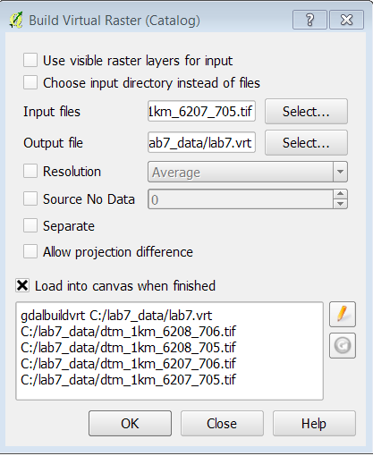

The new image is in one piece as show in this figure. Now it is possible to colourize, calculate and perform terrain analysis. But before all this you have to know more about the dataset. 

_QGIS_Desktop_2.png "Digital Elevation Model (DTM) QGIS Desktop") 
	

### Explore your dataset.
	
1.	Open the Layer Properties by doubleclick on the layer and choose the **General tab**. Notice that the raster is in the UTM coordinate system. UTM has X/Y coordinate values in meters. 

2.	Now switch to the **Metadata** tab. Notice that the Pixel size is 0.4 x 0.4. This means each cell represents a 0.40 by 0.40 meter area. 

3.	Now switch to the **Style tab**. The elevation values (Z) of a DTM are typically either feet or meters. For me, the min value reads 33.2843 and the max value 54.5274. Your values may differ slightly. By default, the Load min/max values is set to Cumulative count cut and the Accuracy is set to Estimate (faster). Switch the Load min/max values to **Min/Max** and the Accuracy to **Actual (slower)** and click the **Load** button. The values should now read 33.2843 to 69.6595. These elevation units are in meters. Before working with DTM’s it is important to understand what unit the X, Y and Z values are in. Here all three are in meters. 

4.	Close the Layer Properties window.

5.	Click the **Identify Feature** button and then click in the image. The X, Y and Z values for the exact point are shown in the window. The Z value are stored in **Band1**. The X and Y are Derived.

### Profile Tool
1.	Install the Plugin **Profile Tool**. From the menu bar choose **Plugins -> Manage and Install Plugins**. Type ‘Profile tool’ into the Search bar. Find the **Profile Tool** plugin and click the box to enable it. Close the Plugins window. 
2.	Zoom in on the Map. Click on the **Profile Tool** icon. A new docked window appear. 
3.	Click and Drag a line on the Map Canvas. Double click to finish. See a view of the Terrain profile.  

 

###Save Layer Definition
Save your layer as **Layer Definition file** Lab7.qlr. 
Rightclick at **Lab7>Save As Layer Definition file**.

## Task 2 Terrain Analysis ##

You will use the GDAL Analysis tool in the Processing menu to create the three elevation related datasets.

###Processing Toolbox
You are going to use the Processing Toolbox in an advanced mode.

1.	Click on **Processing>Toolbox**
2.	In the bottom of the Toolbox dialog, Click on **Simplified interface** and change it to **Advanced interface**. Your Toolbox then look like the figure.

To find an Algorithm - type the name in name in the **Search** field and then double click on the Algorithm to run it.

 

### Hillshade
First you will create a hillshade image which will allow you to get a better feel for the terrain in this area. A hillshade is a grayscale 3D model of the surface, with the sun's relative position taken into account for shading the image. This function uses the latitude and azimuth properties to specify the sun's position. To see how different a map can occour with light from different positions, you are going to create 3 maps:

- Azimuth from 180 (South)
- Azimuth from 270 (West)
- Azimuth from 300 (West/North/West)

All tree maps with light from an Altitude of 30 degree.
What you choose as the right parametre, is depending of what you want to see. Archaeologists use this feature to search the land prehistoric settlements. 

1.	In the Search field type **Hillshade**>Choose **GDAL Hillshade**
2.	Change Azimuth to **180**
3.	Change Altitude to **30**
4.	Click **Run**
5.	Right click at the layername **Output file**. Rename to **Hill_180**
6.	Make two more Hillshades. Change parameter for Azimuth to 270 and 300. Keep the angle on 30. Rename the two new layers with the parametre as the first layer. Remember these layers are only temporary layer.
7.	Close all Hillshade layers
8.	Choose the parametre you like the most, and run the Algorithm again. This time Output File click **...** Filename **Hillshade_xx** xx for the Azimuth value
	

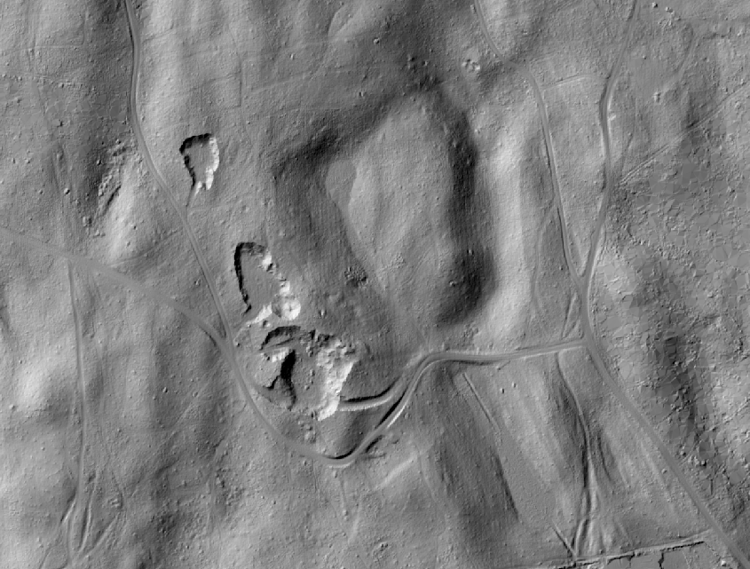

This is grayscale hillshade renderings. Try to click the view off - one at the time - and see how different each layer looks like.
Sometimes it can be difficult to see heights from pits. The eye is tricked. To help you read the map, you are going to put colour on the DTM and make it transparent on top of the hillshade. A colour hillshade image.
 
### Colourize the DTM
1.	Drag the DTM (**lab7**) on top in the Layers Table of Contents.  Open the Layer **Properties>Style tab** (figure below).
	 
2.	Change the Render type to **Singleband pseudocolor**

3.	Change the color ramp to **Spectral** Click to **Invert**.

4.	Change the **Load min/max values** to **Min/max** and the **Accuracy** to **Actual (slower)**.

5.	Click **Classify**

6.	Switch to the **Transparency** tab and set the **Global transparency** to **50%**. Click **OK** and close the Layer Properties. Your map should now resemble the figure below.

7.	Save your layer as **Layer Definition file** Lab7.qlr:
8.	Rightclick at **Lab7>Save As Layer Definition file**. Overwrite the existing file.
9.	Save the Project as **raster_lab7**

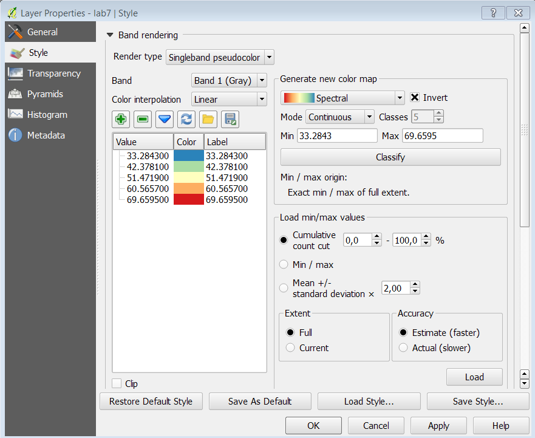

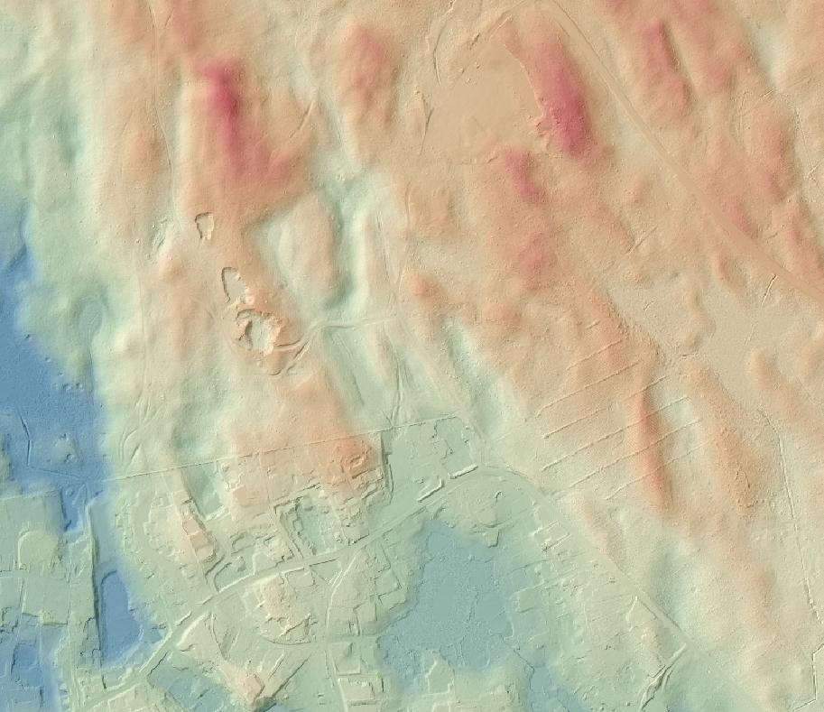

###Slope

> Slope is a measure of change in elevation. It is a crucial parameter in several well-known predictive models used for environmental management, including the Universal Soil Loss Equation and agricultural non-point source pollution models. 
One way to express slope is as a percentage. To calculate percent slope, divide the difference between the elevations of two points by the distance between them, then multiply the quotient by 100. The difference in elevation between points is called the rise. The distance between the points is called the run. Thus, percent slope equals (rise / run) x 100.

> 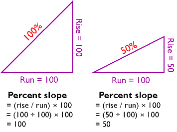
> 
> Another way to express slope is as a slope angle, or degree of slope. As shown below, if you visualize rise and run as sides of a right triangle, then the degree of slope is the angle opposite the rise. Since degree of slope is equal to the tangent of the fraction rise/run, it can be calculated as the arctangent of rise/run.
> 
> 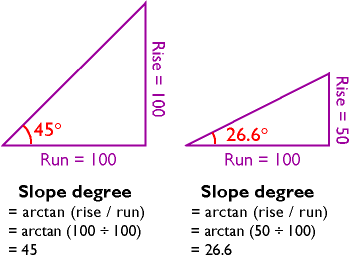
> 
>***Quote: PennState -The Nature of Geographic Information***
>
> Read more about Slope on **[PennState -The Nature of Geographic Information](https://www.e-education.psu.edu/geog482fall2/c7_p10.html "PennState -The Nature of Geographic Information")**

###Create a Slope in Degree

1. In Processing Toolbox Search box type **Slope**>Choose **GDAL Slope**
2. Input Layer **Lab7**
3. Band **1**
4. Scale **1**
5. Output File Click on **...** Firlname **..\slope_degree**
5. Click **Run**
6. Click **Close** - Wait untill the Algorithm has finished
6. Rename the layer to **Slope_Degree**

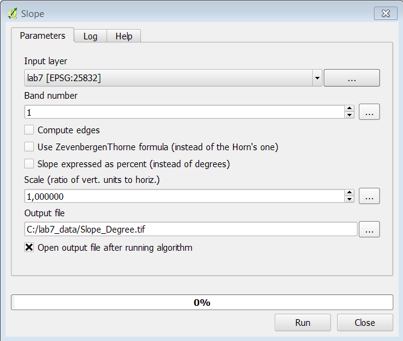

The slope raster shows the steepest areas in white and the flattest terrain in black. The tool determines the steepness of each pixel by comparing the elevation value of each pixel to that of the eight surrounding pixels. The slope values are degrees of slope (figure below).

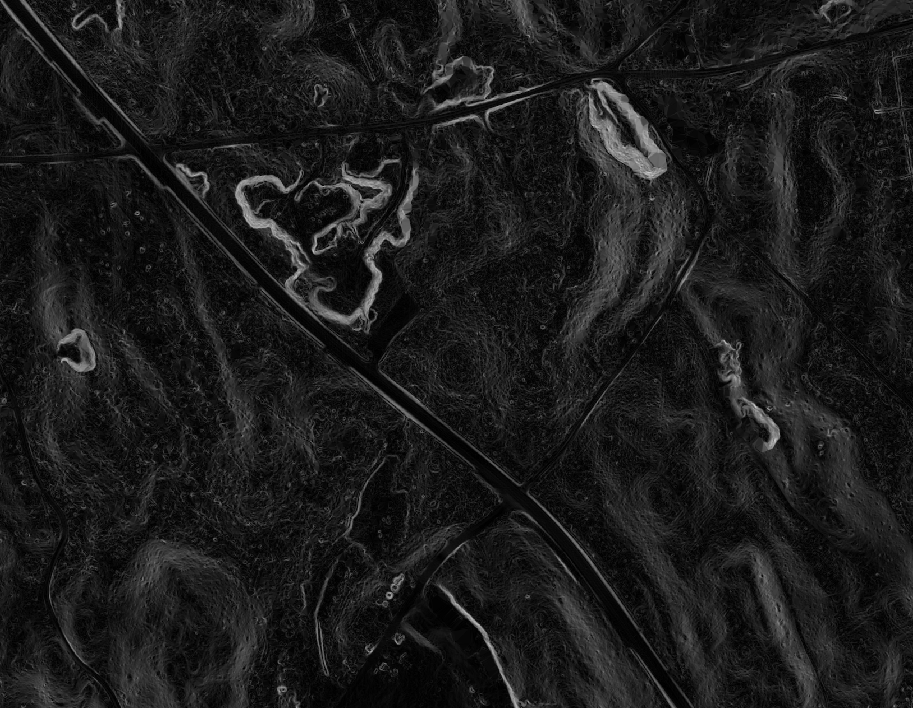

###Colorize the Slope

The Slope map are in greyscale. You are going to give the map colours.

1. Open the **Layer Properties>Histogram**
2. The values goes from 0-60 degree. But it is only a few cells which are above 30 degree. If you colorize with values from 0-60 the map will bee very difficult to read. A lot of cells will be in the same colorrange.
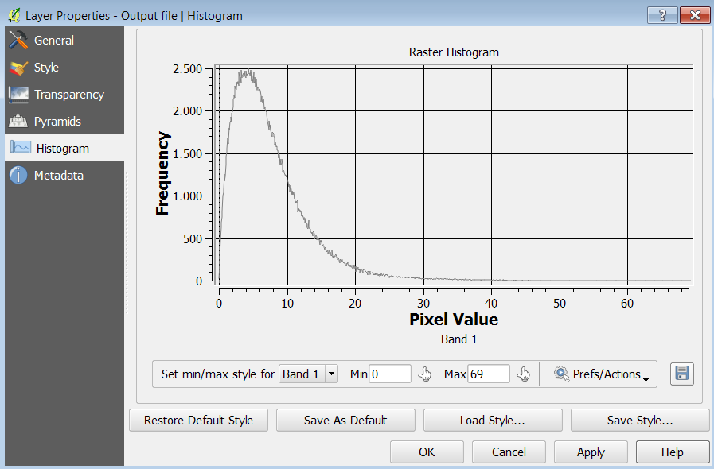
3. Click on **Style tab**. Set the range from **Min: 0** to **Max 20**
4. Generate a new colorramp. Choose **YlOrBr** 
5. Click **+** Add value manually, and write **60**
6. Double click on the pink color. Change the color to dark brown. Change the value to **60** and the label to **60**. Change all the labels to whole numbers.
7. Save the Project

	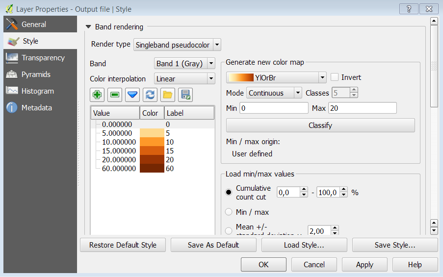

	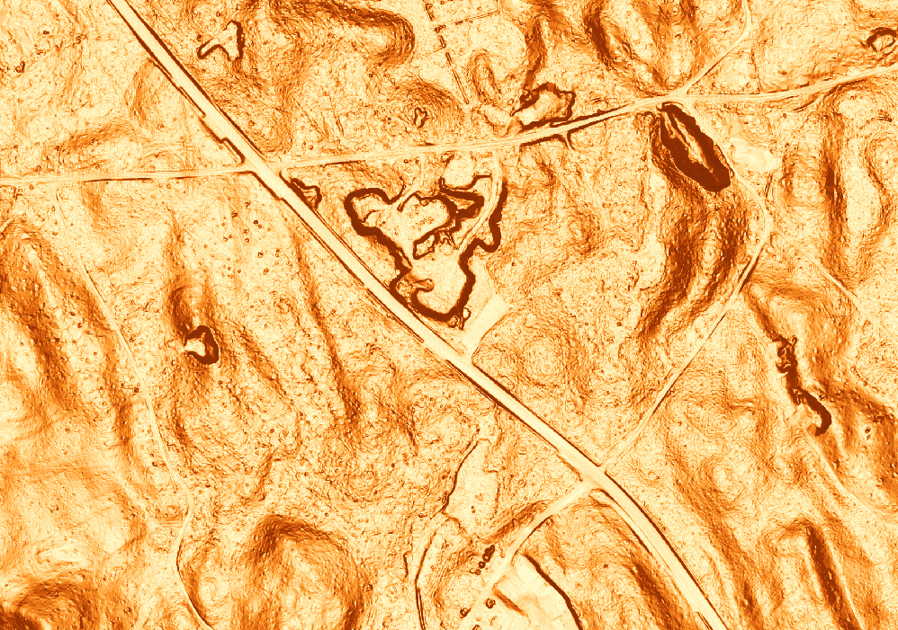

###Aspect

Now you will create an Aspect dataset. Aspect measures which cardinal direction the terrain in each pixel is facing (north facing vs. south facing etc.) 

1. In Processing Toolbox Search box type **Aspect**>Choose **GDAL Aspect**
2. Input Layer **Lab7**
3. Band **1**
4. Output File Click on **...** Filename **..\aspect.tif**
5. Click **Run**
6. Click **Close** - Wait untill the Algorithm has finished
7. Rename the layer to **Aspect**

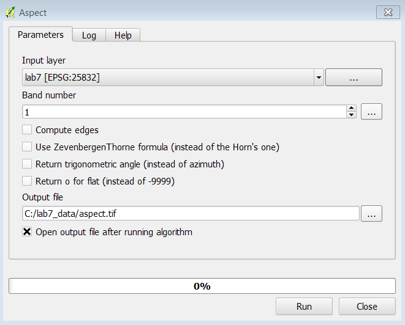

The result - Aspect map in greyscale

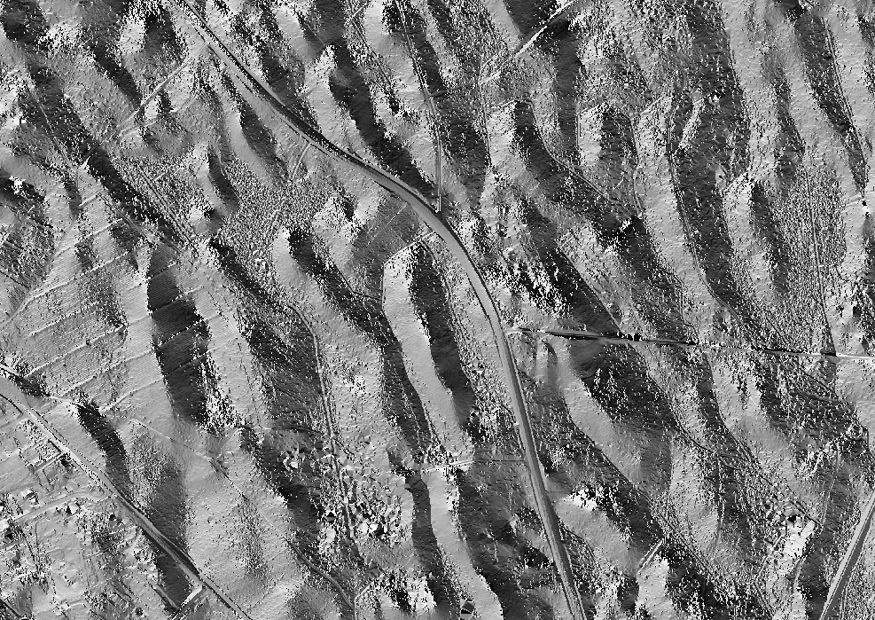

###Colorize the Aspect

The Slope map are in greyscale. You are going to give the map colours.
The output should resemble the figure below with values ranging from ~0-360 representing degrees (0=north, 90= east, 180 = south and 270 = west). 4 colors  + 1 for flat area. In total 5. 

1. Open the **Layer Properties>Style**
2. The values goes from 0-360 degree.
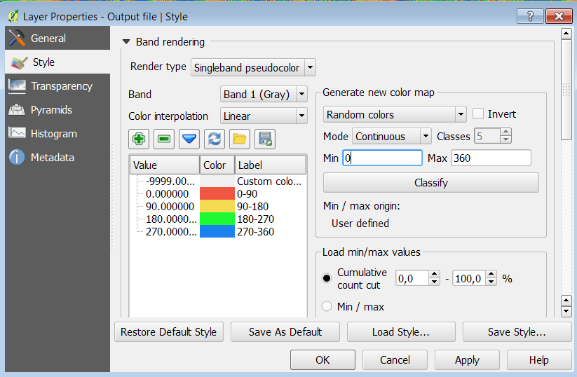
3. Click on **Style tab**. Set the range from **Min: 0** to **Max 20**
4. Generate a new color map. Choose **Random colors** 
5. Mode **Equal interval** Classes **5**
6. Min **0** Max **360**
7. Double click on **360** and write **-9999**
8. Click **+** Add value manually, and write **60**
9. Change all the labels to interval **0-90, 90-180, 180-270, 270-360, Flat.**
10. Save the Project

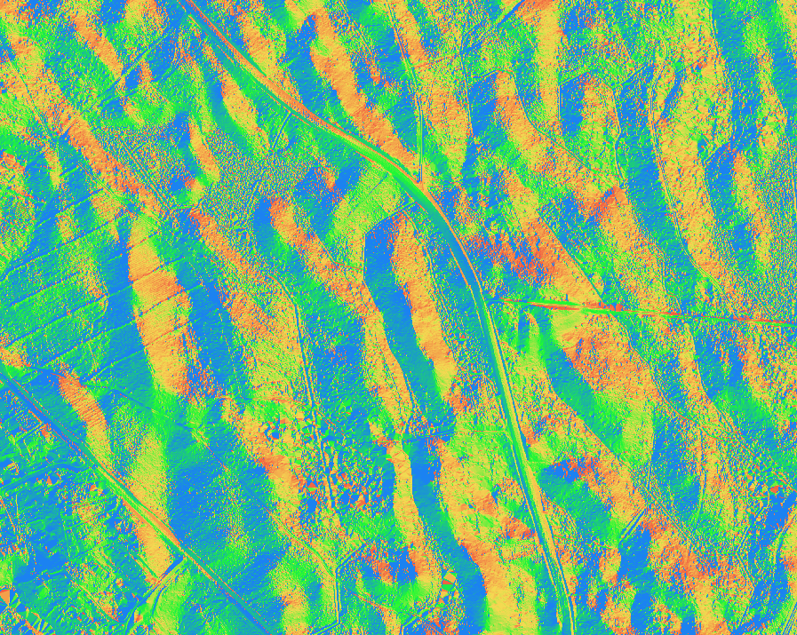

### Task 2 Reclassification

Now that you have created the slope and aspect data you will reclassify them into meaningful categories. Raster reclassification is a method for aggregating data values into categories. In this case, you will be reclassifying them into categories important to identifying habitat suitability for a plant. Once the slope and aspect data have been reclassified you will combine them in Task 3 to identify suitable habitat areas.

1.	Open QGIS Desktop 2.4.0 and open Lab 7/Data/Lab6_Task2.qgs

2.	This plant requires steep slopes. You will classify slope raster into three categories: 0-45, 45-55, and > 55. First you will create a text file that contains the classification rules.
	 
	a.	Open NotePad or a similar text editor and create a text file with in the format of the figure below. 

	b.	The first line tells QGIS to recode cells with slope values between 0 and 45 degrees with a new value of 1. 

	c.	Cells with slope values from 45-55 degrees will receive a new value of 2 and those cells with values greater than 55 will receive a new value of 3. 

	d.	Save the text file to the Lab 7/Data/MyData folder and name it Slope_rRecode_Rules.txt.

	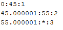 

3.	From the menu bar choose Processing -> Toolbox. Expand the GRASS commands toolset -> Raster (r.*) -> r.recode - Recodes categorical raster maps.
	
	a.	Set the Input layer to Slope. 

	b.	Navigate to the Lab 7/Data/MyData folder and select the Slope_rRecode_Rules.txt as the File containing recode rules. 

	c.	Name the output file Slope_ReCode.img (figure below). 

	d.	Click Run.

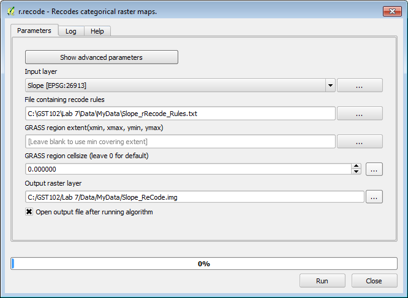

4.	The new layer will be called Output raster layer in the Table of Contents. It appears to have only two categories: 1) black and 2) white. Open the Layer Properties -> Style tab. 
	
	a.	Change the Renderer type to Singleband pseudocolor. 

	b.	Change the color ramp to RdYlGn. 

	c.	Change the Mode to Equal Interval. 

	d.	Set the number of classes to 3. 

	e.	Change the Load min/max values to Min / max.

	f.	Change the Accuracy to Actual (slower)

	g.	Click Load.

	h.	Click Classify.

	i.	Before closing Layer Properties go to the General tab and change the Layer Name to Slope Reclassified.

	j.	Close the Layer Properties.

5.	Now the best habitat in terms of slope has a value of 3 and the worst a value of 1 (figure below).

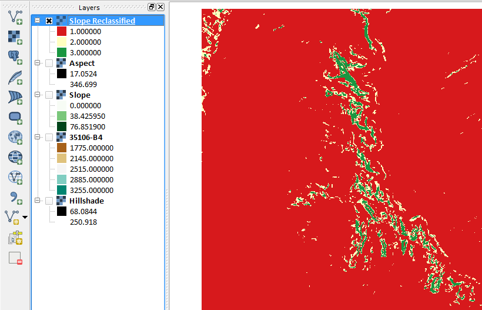

Now you will recode the Aspect data in the same fashion. This plant prefers west facing slopes. Hence the west facing slopes will be set to 3, the north and south are the next best location so set them to 2, and the eastern slopes can be set 1. Remember that the values of the aspect raster are compass bearings or azimuths (270 is due west, 0 is north, 180 is south and 90 is east). You will classify the aspect data into eight cardinal directions. 

6.	Open Notepad and create a text file that looks like the figure below.  Save the text file to your MyData folder and name it Aspect_rRecode_Rules.txt.

	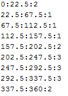 

7.	From the menu bar choose Processing -> Toolbox. Expand the GRASS commands toolset -> Raster (r.*) -> r.recode - Recodes categorical raster maps.
	
	a.	Set the Input layer to Aspect.
 
	b.	Navigate to the Lab 7/Data/MyData folder and select the Aspect_rRecode_Rules.txt as the File containing recode rules. 

	c.	Name the output file Slope_ReCode.img (figure below). 

	d.	Click Run

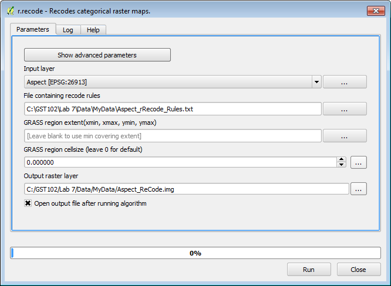

8.	Save you QGIS project.

### Task 3 Raster Calculator

Now you will use the Raster Calculator to combine the reclassified slope and aspect data. The Raster Calculator allows you to combine raster datasets mathematically to produce new outputs. For example raster datasets can be added, subtracted, multiplied and divided against one another. This procedure is also known as raster algebra. In this task you will add the two reclassified rasters together. Since each raster has ideal conditions coded with 3's, an area that ends up with a pixel value of 6 would be ideal. 

1.	Open QGIS Desktop 2.4.0 and open Lab 7/Data/Lab7.qgs

2.	From the menu bar choose Raster -> Raster Calculator. The loaded raster datasets are listed in the upper right window. Below that there are a panel of operators and an expression window (figure below).
	 
	a.	Double click on "Slope Reclassified@1" to place it in the Raster calculator expression.
 
	b.	Click the addition sign. 

	c.	Then click on the "Aspect Reclassified@1" raster. 
 
	d.	In the Result layer section name the output layer Data/MyData/PlantHabitat.img. 

	e.	Choose an Output format of Erdas Imagine Images (*.img)

	f.	Click OK.

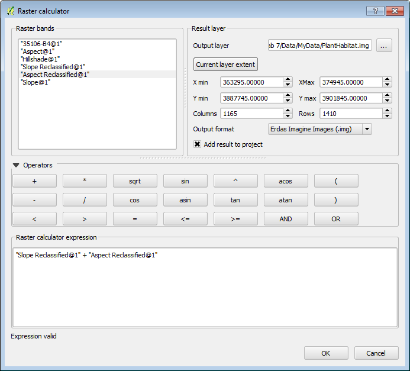

3.	Open the Layer Properties and symbolize the data with 6 equal interval classes. This will be the same procedure you used in Task 2 Step 4.
4.	The final map will resemble the figure below.

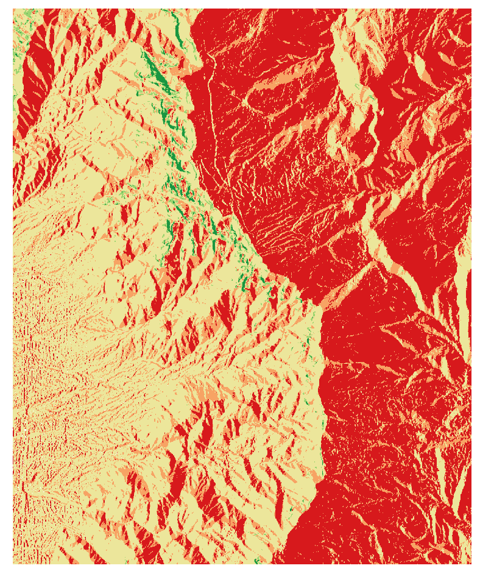

### 5 Conclusion
In this lab, you were exposed to terrain analysis, creating derived datasets from elevation data (DEM's).  You then went on to reclassify two terrain related datasets (aspect and slope), and combine them to produce a suitable habitat layer for a plant species. This is another method of doing site selection analysis. Raster data are well suited for these types of analyses. 

### 6 Discussion Questions

1.	What other real world applications of terrain analysis can you think of? Describe.
2.	How does this suitability analysis compare to the site selection analysis done with the vector data model in Lab 5?
3.	What other linear networks could this apply to other than roads?

### 7 Challenge Assignment

Another scientist is interested in developing a map of potential habitat for another species that prefers rugged, steep west facing slopes. Use the  Raster Terrain Analysis plugin to develop a Ruggedness Index. Recode the Ruggedness Index into three categories:

0:20:1

20:40:2

40:*:3 

Combine the resulting recoded ruggedness index with the recoded slope and aspect from the lab to create the final result. Compose a map showing the results.
